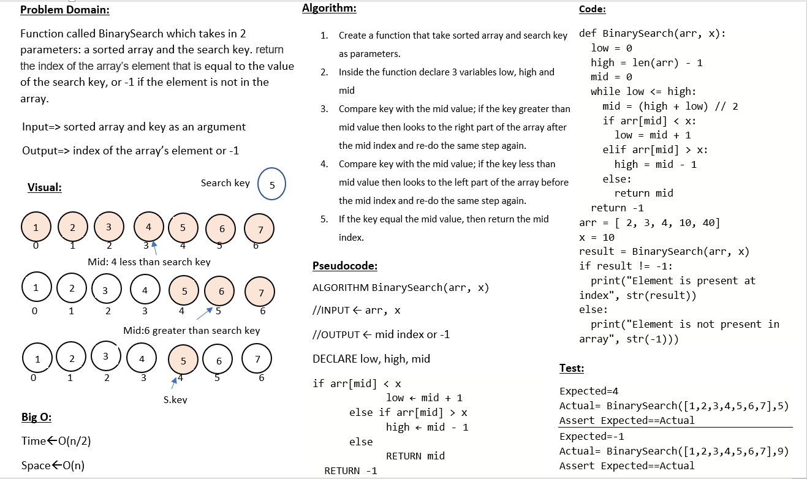

# Binary Search of Sorted Array
Function called BinarySearch which takes in 2 parameters: a sorted array and the search key. return the index of the array’s element that is equal to the value of the search key, or -1 if the element is not in the array.

## Whiteboard Process

## Approach & Efficiency
I used the while loop to iterate over the list

Time complexity : O(n/2)
space complexity : O(n)

