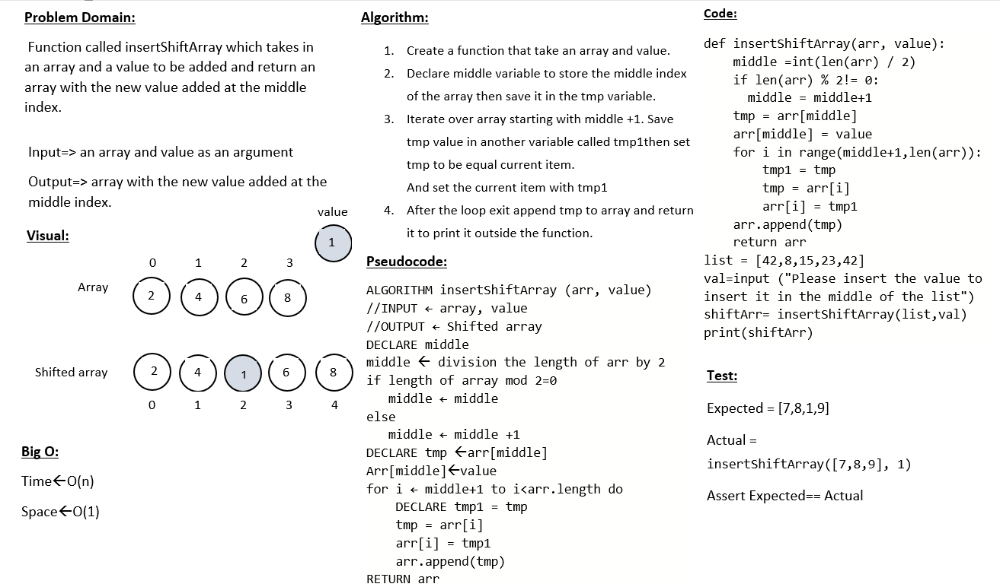

# Insert to Middle of an Array
Function called insertShiftArray which takes in an array and a value to be added and return an array with the new value added at the middle index.

## Whiteboard Process

## Approach & Efficiency

I used a function which finding the middle index and inserted the value on that index

time complexity : O(n)
space complexity :O(1)

