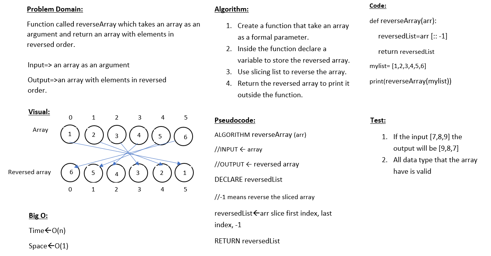
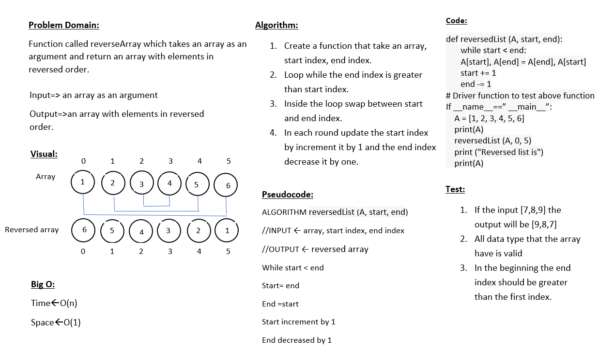

# Reverse an Array
a function that take an array and return the reversed one

## Whiteboard Process

## Strech Goal

## Approach & Efficiency
1. I used the slicing list method to reverse the array it does not take much space and time to do the required

2. I used the loop to swap the indexes with eachother

I think the first approach is efficient
