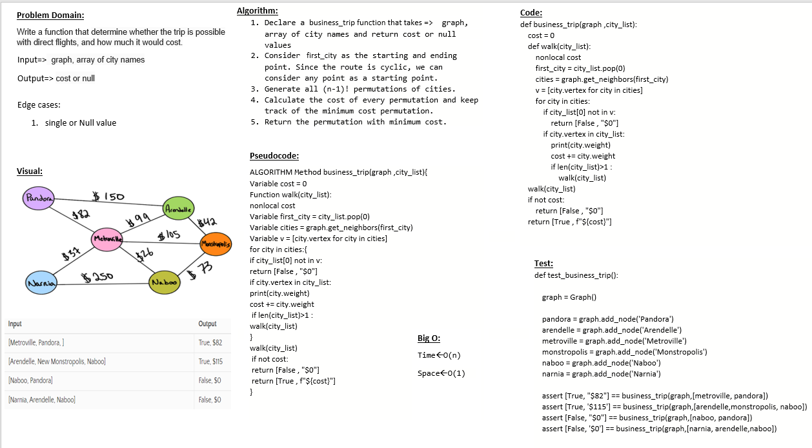
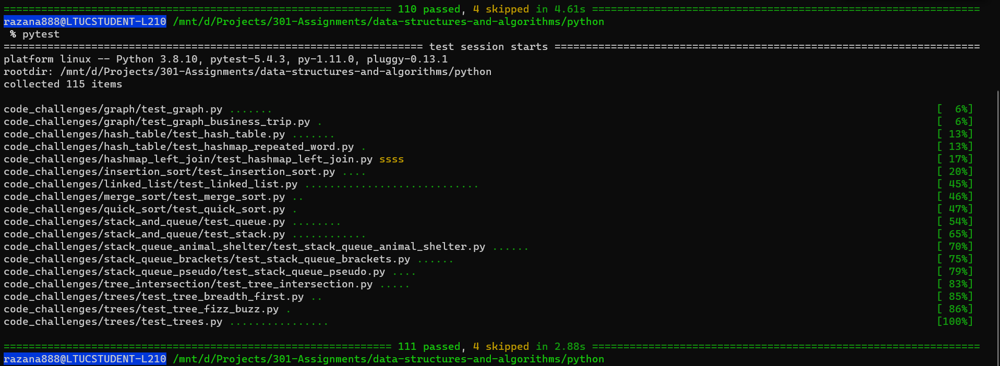

# Challenge Summary
write a function that takes a graph and list of city names
as a parameter and return the cost of the trip between
these cities

## Whiteboard Process

## Approach & Efficiency
- Time : O(n)
- Space : O(1)

## Solution
after cloneing the repo navigate to `python/code_challenges/graph ` directory then run `poetry shell` and `poerty install` then run `pytest`

