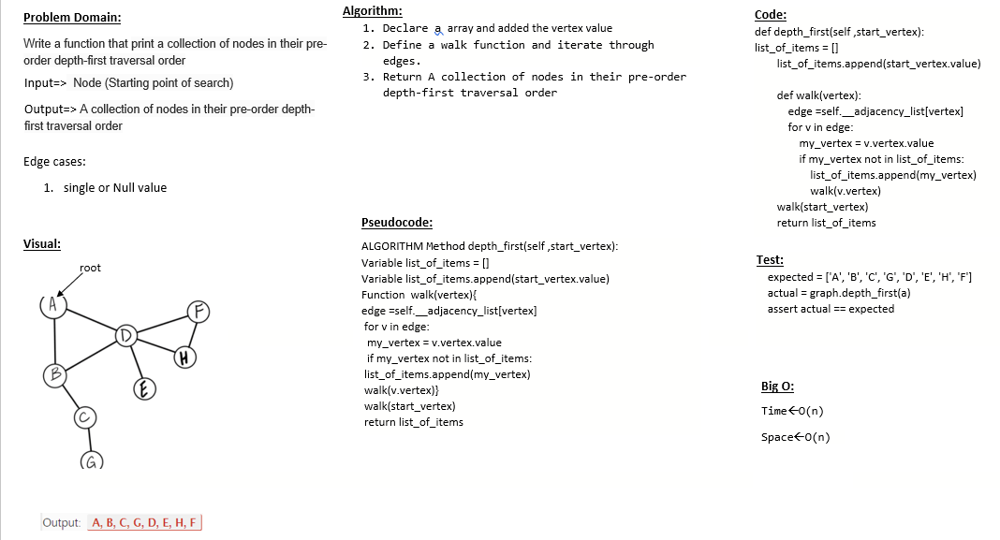
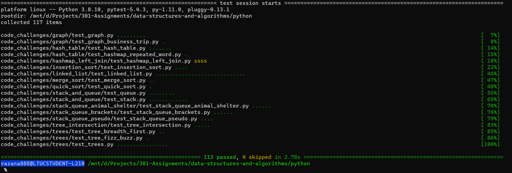

# Depth First Traversal
an algorithm for traversing or searching tree or graph data structures. The algorithm starts at the root node (selecting some arbitrary node as the root node in the case of a graph) and explores as far as possible along each branch before backtracking

## Challenge
write a method inside the Graph Class called depth_first that takes a self and vertex as a parameter and return a collection of vertex in their pre-order depth-first traversal order

## Whiteboard

## Approach & Efficiency
- Time : O(n)
- Space : O(n)

## Solution
after cloneing the repo navigate to `python/code_challenges/graph ` directory then run `poetry shell` and `poerty install` then run `pytest`

