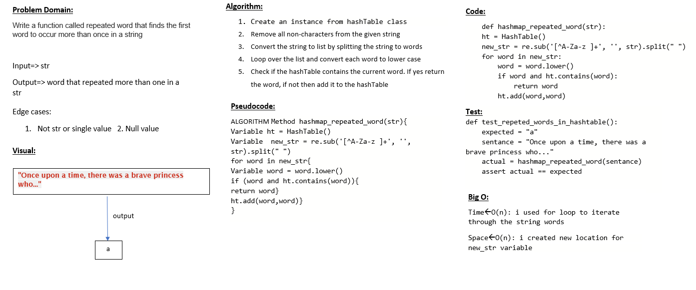
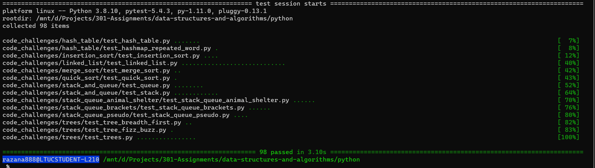

# Challenge Summary
Find the first repeated word in a book.

## Whiteboard Process

## Approach & Efficiency
- Time: O(n) : i used for loop to iterate through the string words
+ Space :O(n) : i created new location for new_str variable

## Solution
after cloneing the repo navigate to `python/hash_table ` directory then run `poetry shell` and `poerty install` then run `pytest`

