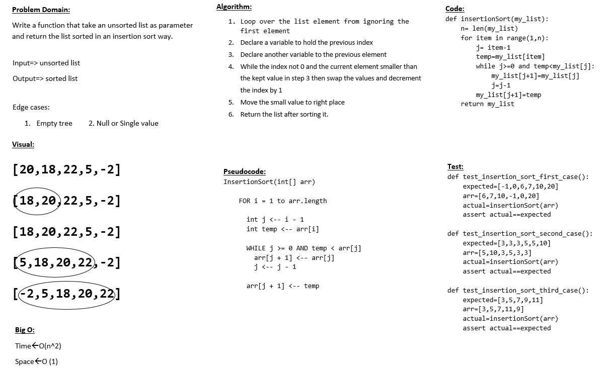
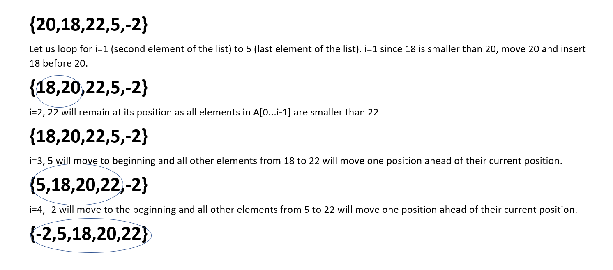
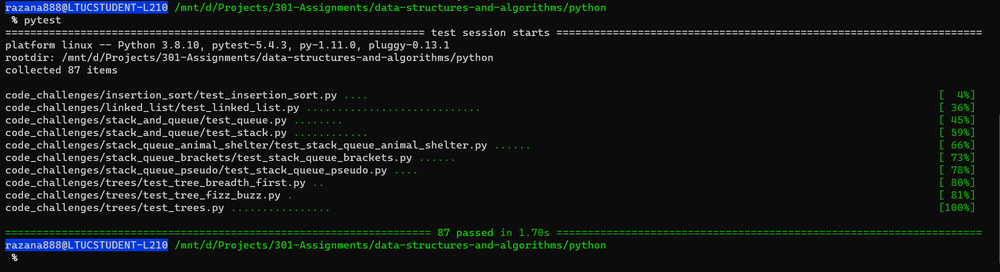

# Challenge Summary
Insertion sort is a simple sorting algorithm that works similar to the way you sort playing cards in your hands. The array is virtually split into a sorted and an unsorted part. Values from the unsorted part are picked and placed at the correct position in the sorted part.

## Whiteboard Process

# Trace
**Example :** [20,18,22,5,-2]


# Test (python) :
```python
def test_selection_sort_first_case():
    expected =[-2,5,8,12,18,20]
    arr = [20,18,12,8,5,-2]
    actual = insertionSort(arr)
    assert actual == expected

def test_selection_sort_second_case():
    expected =[5,5,5,7,7,12]
    arr = [5,12,7,5,5,7]
    actual = insertionSort(arr)
    assert actual == expected

def test_selection_sort_third_case():
    expected =[2,3,5,7,11,13]
    arr = [2,3,5,7,13,11]
    actual = insertionSort(arr)
    assert actual == expected

```
## Approach & Efficiency
- Time Complexity: O(n^2)
- Space Complexity: O(1)

## Solution
after cloneing the repo navigate to `python/code_challenges/insertion_Sort ` directory then run `poetry shell` and `poerty install` then run `pytest`



