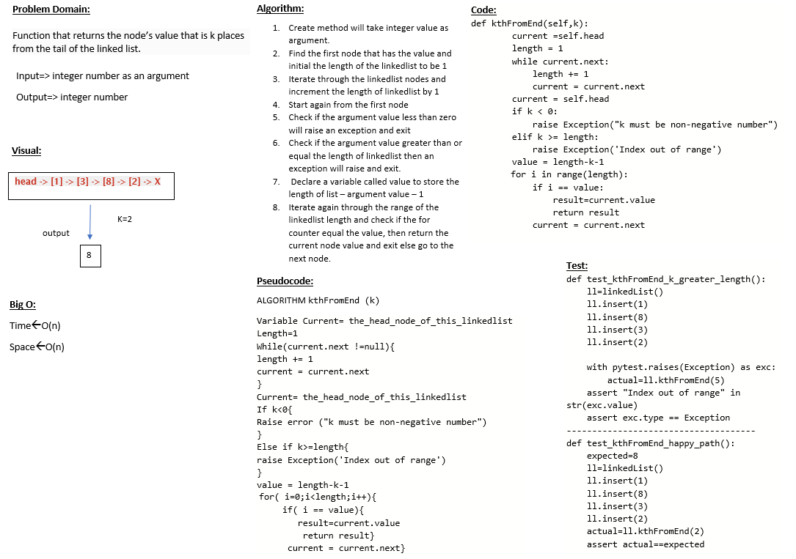

# Challenge Summary
Implement the Linked list data structure that can return the kth of the given number in the linked list

## Whiteboard Process

## Approach & Efficiency
I used loop to find the length for linked list ,and I used if statement to find which node matched the given k

## Solution
Navigate to python/code_challenges then run poetry install then convert the shell to poetry shell and run pytest.
