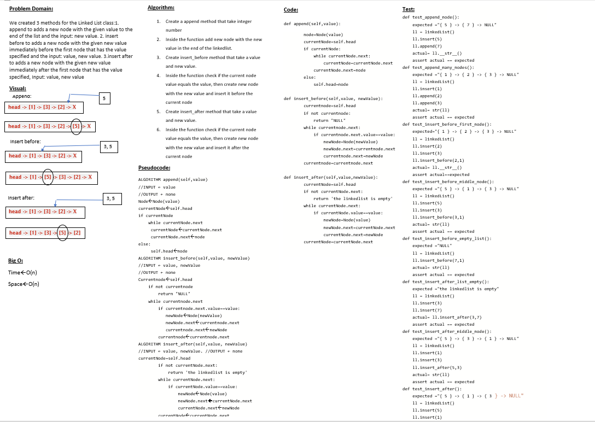

# Challenge Summary
Implement the Linked list data structure that can Insert nodes and search for spesific node data and print out the linked list data

## Whiteboard Process

## Approach & Efficiency
I use classes to implement for linked list ,first class for Node that take the node data and the pointer for the next node ,the second class for the linked list it self that contains three methods ,the insert method , contains or includes method and to_string method that print out the linked list data

## Solution
Navigate to python/code_challenges then run poetry install then convert the shell to poetry shell and run pytest.
