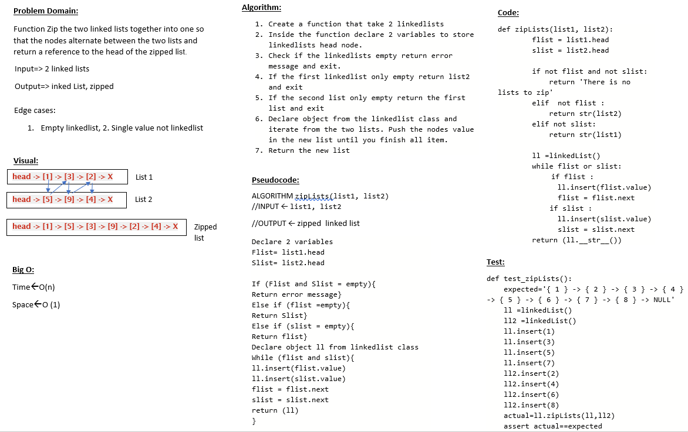

# Challenge Summary
Zip the two linked lists together into one so that the nodes alternate between the two lists and return a reference to the head of the zipped list.
## Whiteboard Process

## Approach & Efficiency
I use while loop and if statment to zip the two list

## Solution
Navigate to python/code_challenges then run poetry install then convert the shell to poetry shell and run pytest.
