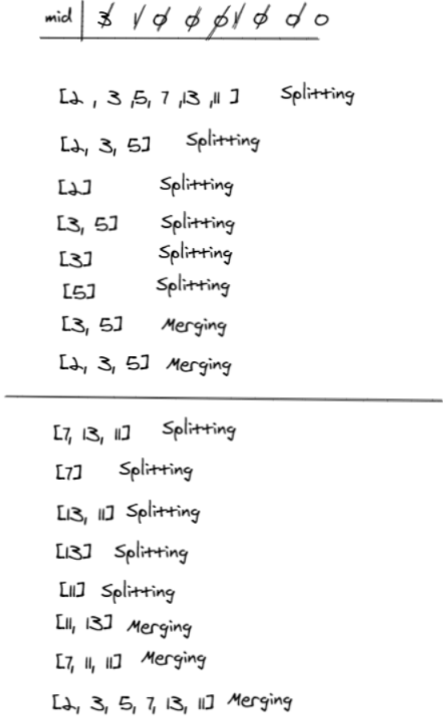

# Merge sort
**Merge sort** is a sorting technique based on divide and conquer technique. With worst-case time complexity being Ο(n log n), it is one of the most respected algorithms.

## Pseudo Code
```pesudo
ALGORITHM Mergesort(arr)
    DECLARE n <-- arr.length

    if n > 1
      DECLARE mid <-- n/2
      DECLARE left <-- arr[0...mid]
      DECLARE right <-- arr[mid...n]
      // sort the left side
      Mergesort(left)
      // sort the right side
      Mergesort(right)
      // merge the sorted left and right sides together
      Merge(left, right, arr)

ALGORITHM Merge(left, right, arr)
    DECLARE i <-- 0
    DECLARE j <-- 0
    DECLARE k <-- 0

    while i < left.length && j < right.length
        if left[i] <= right[j]
            arr[k] <-- left[i]
            i <-- i + 1
        else
            arr[k] <-- right[j]
            j <-- j + 1

        k <-- k + 1

    if i = left.length
       set remaining entries in arr to remaining values in right
    else
       set remaining entries in arr to remaining values in left

```
## Trace
**Example** : [2, 3, 5, 7, 13, 11]



## Code
```python
def mergeSort(alist):
    n = len(alist)
    if n > 1:
        mid = n//2
        lefthalf = alist[:mid]
        righthalf = alist[mid:]

        mergeSort(lefthalf)
        mergeSort(righthalf)
        merge(lefthalf, righthalf, alist)

    return alist


def merge(lefthalf, righthalf, alist):
    i = 0
    j = 0
    k = 0
    while i < len(lefthalf) and j < len(righthalf):
        if lefthalf[i] <= righthalf[j]:
            alist[k] = lefthalf[i]
            i = i+1
        else:
            alist[k] = righthalf[j]
            j = j+1
        k = k+1

    if i < len(lefthalf):
        alist[k] = lefthalf[i]
        i = i+1
        k = k+1

    elif j < len(righthalf):
        alist[k] = righthalf[j]
        j = j+1
        k = k+1
```
## Test
```python
def test_merge_sort():
    expected = [4, 8, 15, 16, 23, 42]
    list = [8, 4, 23, 42, 16, 15]
    actual = mergeSort(list)
    assert actual == expected


def test_merge_sort_case2():
    expected = [5, 5, 5, 7, 7, 7]
    list = [5, 12, 7, 5, 5, 7]
    actual = mergeSort(list)
    assert actual == expected
```
