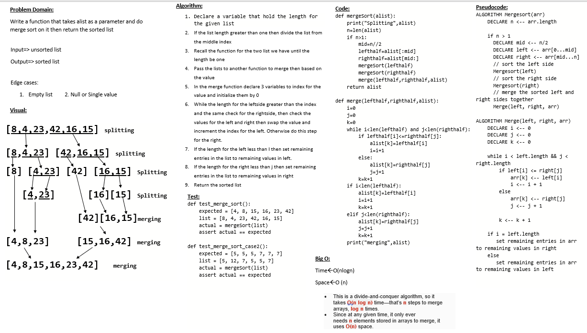

# Challenge Summary
**Merge Sort** is a Divide and Conquer algorithm. It divides the input array into two halves, calls itself for the two halves, and then merges the two sorted halves.

## Blog
[blog](BLOG.md)

## Whiteboard Process

## Approach & Efficiency
- Time :O(nlogn)
- space :O(n)
This is a divide-and-conquer algorithm, so it takes O(n log n) time—that’s n steps to merge arrays, log n times.
Since at any given time, it only ever needs n elements stored in arrays to merge, it uses O(n) space.

## Solution
after cloneing the repo navigate to `python/Code_challenge/merge_sort ` directory then run `poetry shell` and `poerty install` then run `pytest`

