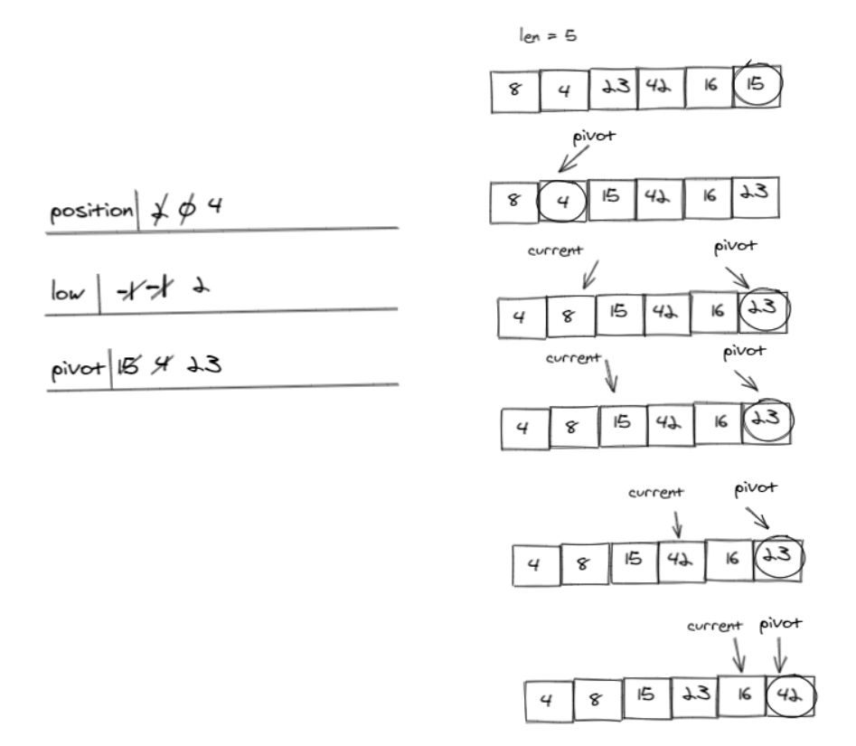

# Quick sort
 QuickSort is a Divide and Conquer algorithm. It picks an element as pivot and partitions the given array around the picked pivot.


# Pseudocode
```python
ALGORITHM QuickSort(arr, left, right)
    if left < right
        DEFINE position <-- Partition(arr, left, right)
        QuickSort(arr, left, position - 1)
        QuickSort(arr, position + 1, right)

ALGORITHM Partition(arr, left, right)
    DEFINE pivot <-- arr[right]
    DEFINE low <-- left - 1
    for i <- left to right do
        if arr[i] <= pivot
            low++
            Swap(arr, i, low)
Swap(arr, right, low + 1)
     return low + 1

ALGORITHM Swap(arr, i, low)
    DEFINE temp;
    temp <-- arr[i]
    arr[i] <-- arr[low]
    arr[low] <-- temp
```
## Trace


## Code
```python
def quick_sort(list, left, right):
    print(list)
    if left < right:
        position = partition(list, left, right)
        print(position)
        quick_sort(list, left, position-1)
        quick_sort(list, position + 1, right)
    return list


def partition(list, left, right):
    pivot = list[right]
    print("pivot",pivot)
    low = left - 1
    print("flow",low)

    for i in range(left, right):
        if list[i] <= pivot:
            low += 1
            swap(list, i, low)
    swap(list, right, low + 1)
    print("low",low)
    return low + 1


def swap(list, i, low):
    temp = list[i]
    list[i] = list[low]
    list[low] = temp

```

## Test
```python
def test_quick_sort():
    expected = [4, 8, 15, 16, 23, 42]
    list = [8, 4, 23, 42, 16, 15]
    n = len(list)
    actual = quick_sort(list, 0, n-1)
    assert actual == expected

```

