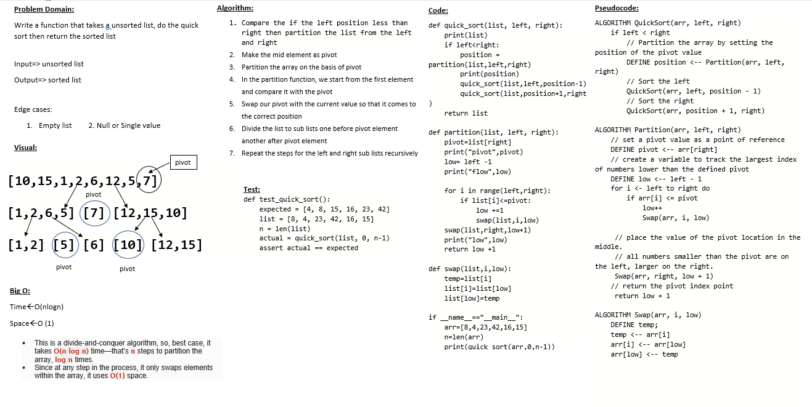
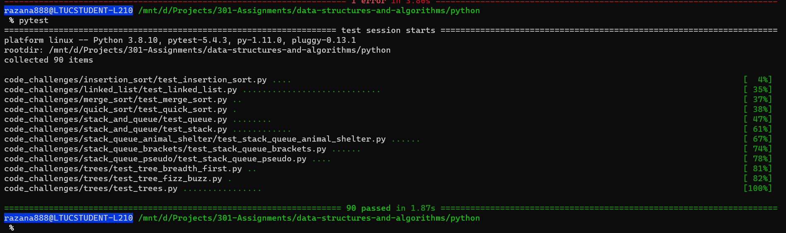

# Challenge Summary
Review the pseudocode for **Quick sort**, then trace the algorithm by stepping through the process with the provided sample array. Document your explanation by creating a blog article that shows the step-by-step output after each iteration through some sort of visual.

## Blog
[blog](BLOG.md)

## Whiteboard Process

## Approach & Efficiency
- Time : O(nLogn).
- space : O(1)

## Solution
after cloneing the repo navigate to `python/code_challenges/quick_sort ` directory then run `poetry shell` and `poerty install` then run `pytest`

