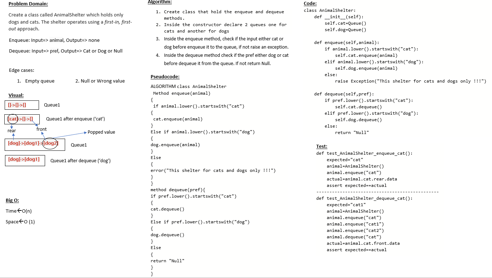

# Challenge Summary
create cat and dog shelter using your queue implementation

## Whiteboard Process

## Approach & Efficiency
I use two queues to implement the animal shelter ,one for the cats ,and another for the dogs

enqueue -> O(1)
dequeue -> O(1)

## Solution
Navegate to `python/code_challenge/stack_and_queue_animal_shelter` then open the termenal and run `poetry shell` the pytest the `stack_and_queue_animal_shelter`
