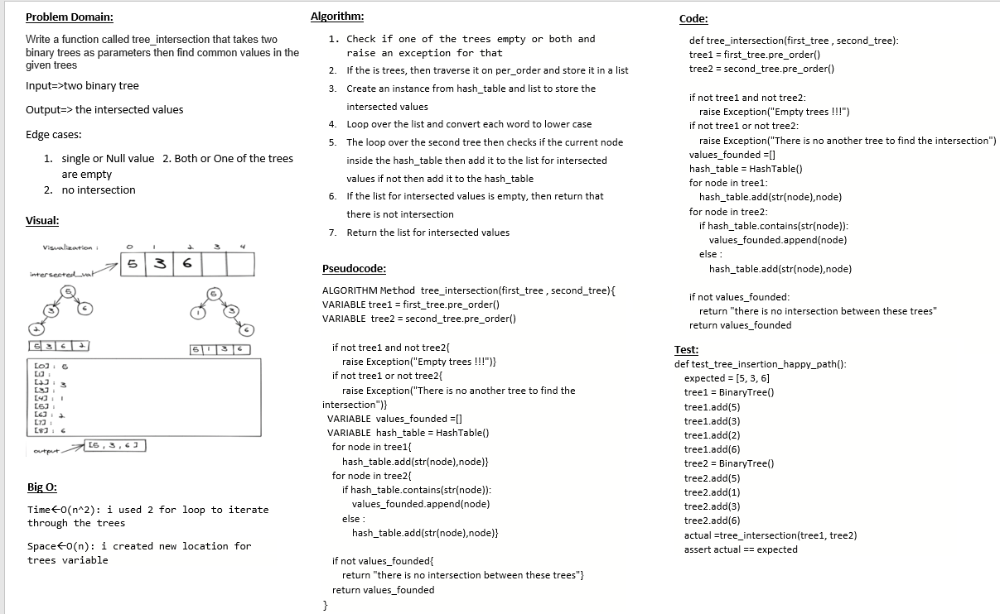
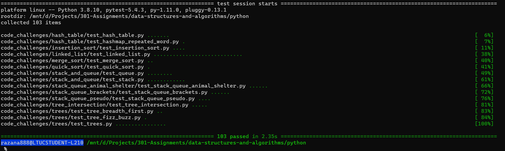

# Challenge Summary
Find common values in 2 binary trees using hash map

## Whiteboard Process

## Approach & Efficiency
- Time : O(n^2)
- Space : O(n)

## Solution
after cloneing the repo navigate to `python/tree_intersection ` directory then run `poetry shell` and `poerty install` then run `pytest`

