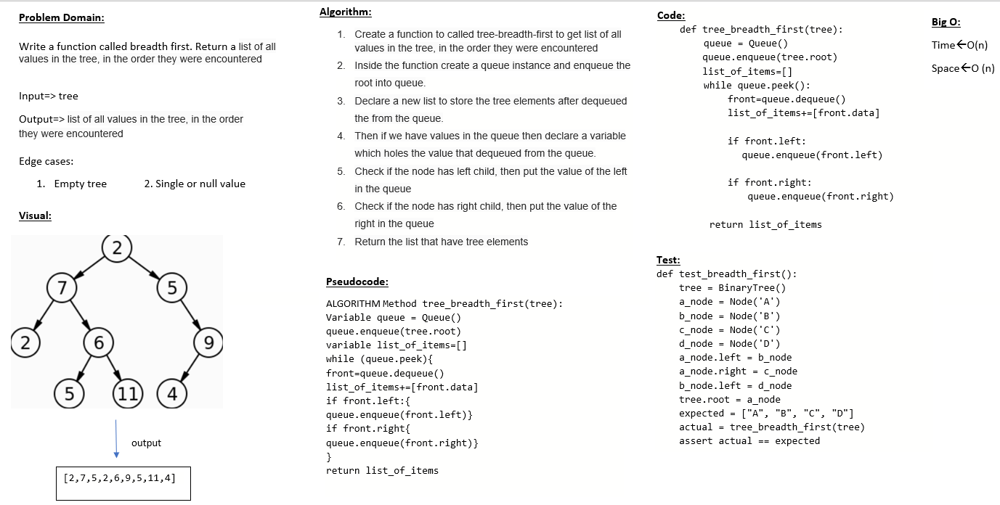

# Challenge Summary
return the tree in breadth-first Traversal

## Whiteboard Process

## Approach & Efficiency
I use a queue and a list to traversal the tree element and loop over the queue if it have elements or not

time : O(n)
space : O(n)

## Solution
Navegate to `python/code_challenge/trees` then open the termenal and run `poetry shell` the pytest the `tree_breadth_first
