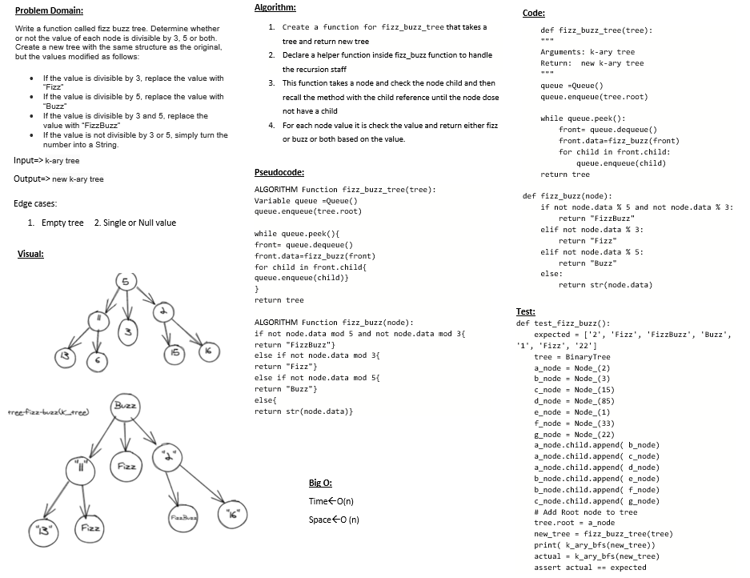

# Challenge Summary
Determine whether or not the value of each node is divisible by 3, 5 or both. Create a new tree with the same structure as the original, but the values modified as follows:

- If the value is divisible by 3, replace the value with “Fizz”
- If the value is divisible by 5, replace the value with “Buzz”
- If the value is divisible by 3 and 5, replace the value with “FizzBuzz”
- If the value is not divisible by 3 or 5, simply turn the number into a String

## Whiteboard Process

## Approach & Efficiency
I use helper function inside the  method to do the recaerssion staff and fill the new tree with `Fizz` or `Buzz` or both

time : O(n)
space : O(n)

## Solution
Navegate to `python/code_challenge/trees` then open the termenal and run `poetry shell` the pytest the `tree_fizz_buzz
